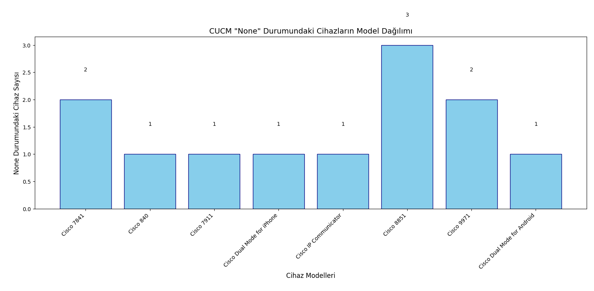

# CUCM None Device Analyzer & Reporter


Bu proje, **Cisco Unified Communications Manager (CUCM)** altyapısında bulunan cihazların (IP Telefonlar, Softphone'lar vb.) canlı durumlarını denetlemek için geliştirilmiştir. Sistemdeki "None" cihazları tespit eder, model bazlı grafiksel analiz sunar ve operasyonel ekipler için Excel raporları oluşturur.


## Özellikler

* **AXL Entegrasyonu:** CUCM veritabanından cihaz isimlerini ve model bilgilerini otomatik olarak çeker.
* **RISPort Real-Time Analiz:** Cihazların anlık kayıt durumlarını sorgular.
* **Görsel Raporlama:** `matplotlib` kullanarak hangi modelden kaç adet "None" cihaz olduğunu bar grafik ile gösterir.
* **Excel Çıktısı:** `pandas` kütüphanesi ile detaylı "None" cihaz listesini `.xlsx` formatında kaydeder.
* **Rate Limit Koruması:** Büyük ölçekli sistemlerde CUCM servislerini yormamak için bekleme süreleri içerir.


## Gereksinimler

* **AXL ve RISPort servislerinin CUCM üzerinde aktif olması.** 
* **Python 3.8+**


## Bağımlılıkları yükleme
```bash
pip install -r requirements.txt
```


## Proje İçeriği

Proje, iki ana Python betiğinden oluşmaktadır. Her iki betik de Cisco AXL (SOAP) ve RISPort (Real-time Information Service) API'lerini harmanlayarak çalışır.

* **1. none_devices_with_model.py:** Bu script, sistemdeki verimliliği ölçmek ve donanım envanterini temizlemek için tasarlanmıştır. `ciscoaxl` kütüphanesi kullanılarak CUCM veritabanından tüm cihaz isimleri ve model bilgileri çekilir. Toplanan cihaz isimleri, 100'erli paketler halinde RISPort servisine gönderilir. RISPort yanıtında aktif bir IP veya Status bilgisi dönmeyen (yani sistemde kayıtlı olmayan) cihazlar filtrelenir. `matplotlib` kullanılarak, kayıtsız cihazların model bazlı dağılımı (örn: Cisco 7841, Cisco 8845) bir sütun grafiği ile raporlanır. Bu, hangi model cihazların daha çok sorun çıkardığını veya boşa çıktığını anlamanızı sağlar.

* **2. none_devices_to_excel.py:** Bu script, temizlik operasyonları için doğrudan çıktı üretmeye odaklanır. Büyük ölçekli ağlarda (10,000+ kullanıcı) CUCM servislerinin (Tomcat/RIS) çökmemesi için her 100 sorguda bir 4.5 saniyelik `time.sleep` mekanizması uygulanır. Sorgu sırasında oluşabilecek "Rate Limit" hataları yakalanır ve script otomatik olarak kendini bekleme moduna alarak işlemin kesintisiz tamamlanmasını sağlar. Elde edilen "None" durumundaki cihaz listesi `pandas.DataFrame` yapısına dönüştürülerek None_Cihazlar_Raporu.xlsx ismiyle kaydedilir.


## Proje Çıktısı

Proje çıktısının belirli bir kısmı aşağıdaki örnekteki gibidir:

```text
AXL: Veritabanından cihaz ve model bilgileri çekiliyor...
Başarılı: 5420 cihaz sayım için hazır.

#     | Cihaz Adı                 | Model                     | Durum     
---------------------------------------------------------------------------
1     | SEP7A11C87D07C4           | Cisco 7841                | None
2     | SEPEAF55C447BAB           | Cisco 840                 | None
3     | SEP8D9C22D03F88           | Cisco 7841                | None
4     | SEP01188F574785           | Cisco 7911                | None
5     | TCTUSER                   | Cisco Dual Mode for iPhone | None
6     | SEPUSER                   | Cisco IP Communicator     | None
7     | SEP2C7BA3C22C8F           | Cisco 8851                | None
8     | SEP00521A78DCAF           | Cisco 8851                | None
9     | SEP00478D87A1F5           | Cisco 8851                | None
10    | SEP36ACC9D4F2F4           | Cisco 9971                | None
11    | SEP07006CE9D047           | Cisco 9971                | None
12    | BOTUSER                   | Cisco Dual Mode for Android | None
---------------------------------------------------------------------------
```

## Grafiksel Analiz
`find_none_devices.py` betiği çalıştırıldığında, CUCM üzerindeki cihazların model bazlı dağılımını gösteren aşağıdaki grafik otomatik olarak oluşturulur:




