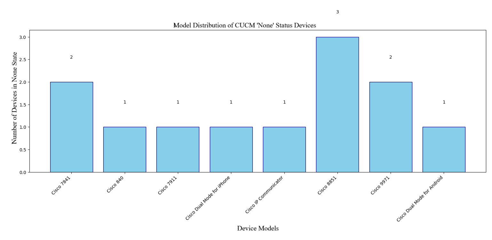

# CUCM None Device Analyzer

# CUCM None-Device Analyzer

This project provides an automated solution for Cisco Unified Communications Manager (CUCM) administrators to identify and visualize devices with a "None" (unassigned) registration status. By combining AXL for inventory and RISPort70 for real-time status, it helps optimize licensing and database hygiene.


**Technology stack:**
- Language: Python 3.x
- APIs used: Cisco AXL (SOAP/XML), Cisco RISPort70 (SOAP/XML)
- Libraries: `ciscoaxl`, `zeep`, `requests`, `matplotlib`, `python-dotenv`
- Status: Beta


> *Example output: bar chart showing model distribution of "None" status devices.*

---

## Use Case

In enterprise UC environments, CUCM databases often accumulate devices that are no longer actively registered — phones from decommissioned sites, migrated endpoints, or devices that failed to re-register after configuration changes. These devices consume licenses and create noise in inventory reports.

This script automates the detection process by:

1. Pulling all registered phone objects from CUCM via AXL
2. Querying their live registration status in real-time via RISPort70
3. Cross-referencing both data sources to identify devices with **no active registration (None status)**
4. Generating a **console table** and a **bar chart** sorted by device model for easy prioritization

**Outcome:** Administrators can quickly identify which device models are most affected, take cleanup or troubleshooting action, and reduce unnecessary license consumption.

---

## Installation

### Prerequisites

- Python **3.8+** installed ([Download Python](https://www.python.org/downloads/))
- Network access to your CUCM publisher node (ports `8443`)
- A CUCM user account with the following roles:
  - `Standard AXL API Access`
  - `Standard RealtimeAndTraceCollection`

### Clone the repository

```bash
git clone https://github.com/<ErenKilinc1>/<CUCM-None-Device-Analyzer>.git
cd <CUCM-None-Device-Analyzer>
```

### Create and activate a virtual environment

**macOS / Linux:**
```bash
python3 -m venv venv
source venv/bin/activate
```

**Windows:**
```bash
python -m venv venv
venv\Scripts\activate
```

### Install dependencies

```bash
pip install -r requirements.txt
```

---

## Configuration

The script reads credentials and CUCM connection details from a `.env` file in the project root. Create a file named [`.env`](.env) with the following content:

```env
CUCM_IP=192.168.1.1
CUCM_USERNAME=axl_api_user
CUCM_PASSWORD=your_password_here
```

| Variable | Description |
|---|---|
| `CUCM_IP` | IP address or FQDN of your CUCM Publisher node |
| `CUCM_USERNAME` | Username of a CUCM account with AXL and RIS access |
| `CUCM_PASSWORD` | Password for the CUCM account |

> **Security note:** Never commit your `.env` file to version control. A [`.gitignore`](.gitignore) entry for `.env` is strongly recommended.

The script is pre-configured for **CUCM version 12.5**. If you are running a different version, update the following line in [`cucm_none_checker.py`](cucm_none_checker.py):

```python
ucm = axl(username=USERNAME, password=PASSWORD, cucm=CUCM_IP, cucm_version='12.5')
```

---

## Usage

Ensure your virtual environment is active and your `.env` file is configured, then run:

```bash
python cucm_none_checker.py
```

### What happens

1. The script connects to CUCM via AXL and retrieves all phone objects from the database.
2. It queries RISPort70 in batches of 100 devices (with built-in rate limiting) to retrieve live registration status.
3. Devices not found in any active RIS node response are classified as **"None"** status.
4. Results are printed to the console in a formatted table:

```text
AXL: Fetching device and model information from database...
Success: 5420 devices ready for analysis.

#     | Device Name               | Model                     | State     
---------------------------------------------------------------------------
1     | SEP7A11C87D07C4           | Cisco 7841                | None
2     | SEPEAF55C447BAB           | Cisco 840                 | None
3     | SEP8D9C22D03F88           | Cisco 7841                | None
4     | SEP01188F574785           | Cisco 7911                | None
5     | TCTUSER                   | Cisco Dual Mode for iPhone | None
6     | SEPUSER                   | Cisco IP Communicator     | None
7     | SEP2C7BA3C22C8F           | Cisco 8851                | None
8     | SEP00521A78DCAF           | Cisco 8851                | None
9     | SEP00478D87A1F5           | Cisco 8851                | None
10    | SEP36ACC9D4F2F4           | Cisco 9971                | None
11    | SEP07006CE9D047           | Cisco 9971                | None
12    | BOTUSER                   | Cisco Dual Mode for Android | None
---------------------------------------------------------------------------
...
...
```

5. After processing, a **bar chart** window opens automatically showing the count of "None" devices grouped by model.

### Rate limiting

The RISPort70 API enforces request rate limits. The script automatically pauses **4.5 seconds** between batches of 100 devices. If a rate limit error is detected, it waits an additional **15 seconds** before retrying.

---

## Related Sandbox

You can test this script against a live CUCM environment using the Cisco DevNet Always-On or Reservable Sandboxes:

- [Cisco Collaboration 12.x Sandbox](https://devnetsandbox.cisco.com/RM/Topology) — Search for "Collaboration" to find an available CUCM sandbox.

Update your `.env` file with the sandbox credentials provided at reservation time.

---

## Links to DevNet Learning Labs

- [Introduction to AXL](https://developer.cisco.com/learning/labs/collab-axl-intro/introduction/)
- [Cisco Collaboration APIs Overview](https://developer.cisco.com/learning/modules/collab-cloud/)
- [Cisco CUCM AXL API Reference](https://developer.cisco.com/docs/axl/)

---

## Known Issues

- **CUCM versions below 12.0** may require changes to the `ciscoaxl` initialization parameters and WSDL paths.
- **Self-signed certificates** on CUCM are expected; SSL verification is intentionally disabled via `urllib3`. In production environments, consider providing a proper CA bundle.
- The chart window requires a **graphical display environment**. On headless servers, redirect output to a file using `matplotlib`'s `Agg` backend instead of the default interactive backend.
- Very large deployments (10,000+ devices) will take significant time due to RISPort70 rate limiting.

---

## Getting Help

If you encounter issues or have questions:

- Open an issue in the [GitHub Issues](../../issues) tab of this repository.
- Refer to the [Cisco AXL API documentation](https://developer.cisco.com/docs/axl/).
- Refer to the [Cisco RISPort70 API documentation](https://developer.cisco.com/docs/sxml/#!risport70-api-reference).
- Visit the [Cisco DevNet Community](https://community.cisco.com/t5/developer-general-discussions/bd-p/4046j-disc-dev-general) for broader support.

---

## Getting Involved

Contributions are welcome! Areas where the project could be extended include:

- Exporting results to CSV or JSON
- Adding support for additional device classes (gateways, trunks, CTI route points)
- Filtering by site, device pool, or calling search space
- Scheduling automated runs and alerting

---

## Contribute

1. Fork this repository
2. Create a feature branch (`git checkout -b feature/my-improvement`)
3. Commit your changes with clear messages
4. Open a Pull Request against the `main` branch

---

## Credits and References

- [ciscoaxl](https://github.com/levensailor/ciscoaxl) — Python library for CUCM AXL API by Jeff Levensailor
- [zeep](https://docs.python-zeep.org/) — Python SOAP client used for RISPort70 communication
- [Cisco AXL Developer Guide](https://developer.cisco.com/docs/axl/)
- [Cisco RISPort70 API Reference](https://developer.cisco.com/docs/sxml/#!risport70-api-reference)

---

## License

This code is licensed under the MIT License. See [LICENSE](LICENSE) for details.


## Contact

Project Link: (https://github.com/ErenKilinc1/CUCM-None-Device-Analyzer)

